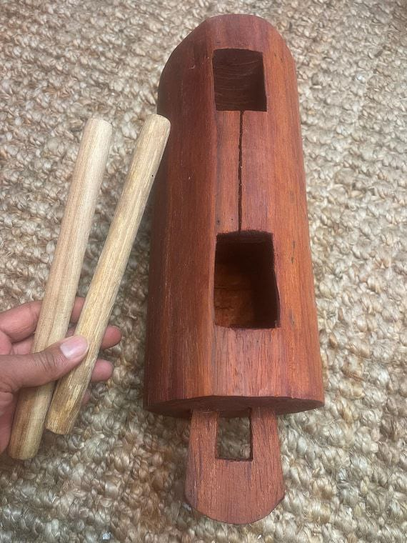

<p align="center">
  
</p>

<h1 align="center">Ekwe Protocol — Whitepaper</h1>

<p align="center">
  <em>A Decentralized Event-Driven Edge Network for Resilient Push Messaging and Offline Transactions Anchored to a Bitcoin Layer-2</em>
</p>

<p align="center">
  <strong>Version 1.0</strong> &nbsp;·&nbsp; February 2026 &nbsp;·&nbsp; David Nzagha
</p>

<p align="center">
  <a href="https://ekwe.network">Website</a> &nbsp;·&nbsp;
  <a href="main.tex">Read the Paper (LaTeX)</a>
</p>

---

## Overview

**Ekwe Protocol** specifies a decentralized, event-driven edge computing network designed for mission-critical operations in connectivity-challenged environments. Inspired by the *Ekwe*, a traditional Igbo communication drum, the protocol provides a "push-like" messaging substrate that operates without continuous Internet access.

The protocol supports:

- **Offline-first delivery** — store-and-forward dissemination across network partitions
- **Multi-radio relaying** — BLE, Wi-Fi Direct, LoRaWAN, and optional legacy radio (UHF/VHF, NFC, QR, audio)
- **Programmable event execution** — verifiable computation at the edge via zkVM
- **Economic metering** — TON-inspired per-event gas accounting with reward splitting
- **Bitcoin L2 settlement** — periodic anchoring to Bitcoin for global finality and auditability

The flagship application, **EkwePay**, enables offline-first financial transactions propagated through community-operated relay networks with eventual settlement on Bitcoin.

## Paper Structure

| # | Section | Description |
|---|---------|-------------|
| 1 | Introduction & Vision | Motivation, cultural foundation (Ekwe drum), and contributions |
| 2 | Background & Motivation | Push infra, USSD, DTN, DePIN, multi-radio transports |
| 3 | Literature Review | DTN routing, mobile money, DePIN, ZKPs, Bitcoin L2 survey |
| 4 | Problem Statement | Formal problem definition |
| 5 | Design Goals & Non-Goals | Explicit scope boundaries |
| 6 | System Architecture | High-level architecture and component overview |
| 7 | Node Roles & Identity | Identity model, node types, network assumptions |
| 8 | Ekwe Event Layer | Event format, addressing, subscription, dissemination semantics |
| 9 | Bridge Logic (Edge Agent) | Convergence layer abstraction, smartphone relaying |
| 10 | Transport Layer | Multi-radio transport details |
| 11 | Gas & Incentive Model | Fee decomposition, sponsorship, reward splitting |
| 12 | Token Economics | $EKWE utility token, BTC mining rewards, staking & slashing |
| 13 | Execution & Verifiable Computing | Executable events, zkVM proofs, execution runtimes |
| 14 | Bitcoin L2 Anchoring | Settlement design, bridging, dispute resolution |
| 15 | EkwePay: Flagship Use Case | Transaction workflow, offline risk controls |
| 16 | Hardware | EkweBox and Smartbox specifications |
| 17 | SDK & Developer Toolkit | API surface, transport abstraction, gas sponsorship |
| 18 | Security & Privacy | Authentication, anti-spam, Sybil resistance, metadata minimization |
| 19 | Implementation Blueprint | Reference implementation, evaluation metrics & scenarios |
| 20 | Roadmap | Development timeline and milestones |
| 21 | Limitations & Open Problems | Known constraints and future research directions |
| 22 | Conclusion | Summary and next steps |

## Diagrams

All architecture and flow diagrams are maintained as [Mermaid](https://mermaid.js.org/) sources in the [`diagrams/`](diagrams/) directory, with rendered PNGs in [`figures/`](figures/).

| Diagram | Source | Description |
|---------|--------|-------------|
| System Architecture | [`d1-architecture.mmd`](diagrams/d1-architecture.mmd) | High-level protocol architecture |
| EkwePay Flow | [`d2-ekwepay-flow.mmd`](diagrams/d2-ekwepay-flow.mmd) | Offline payment transaction workflow |
| Network Topology | [`d3-network-topology.mmd`](diagrams/d3-network-topology.mmd) | Edge cluster and relay topology |
| Gas & Rewards | [`d4-gas-rewards.mmd`](diagrams/d4-gas-rewards.mmd) | Fee decomposition and reward splitting |
| Event Lifecycle | [`d5-event-lifecycle.mmd`](diagrams/d5-event-lifecycle.mmd) | Event creation → relay → execution → settlement |
| Token Economics | [`d6-token-economics.mmd`](diagrams/d6-token-economics.mmd) | Dual-token model ($EKWE + BTC) |
| Technology Landscape | [`d7-landscape.mmd`](diagrams/d7-landscape.mmd) | Positioning vs. existing approaches |
| Roadmap Timeline | [`d8-timeline.mmd`](diagrams/d8-timeline.mmd) | Development milestones |
| DTN Routing | [`d9-dtn-routing.mmd`](diagrams/d9-dtn-routing.mmd) | QoS class → DTN routing strategy mapping |

## Building the Paper

### Prerequisites

A full **TeX Live** (or **MacTeX**) installation is required.

```bash
# macOS (via Homebrew)
brew install --cask mactex

# Ubuntu / Debian
sudo apt-get install texlive-full

# Fedora
sudo dnf install texlive-scheme-full
```

### Compile

```bash
# Using latexmk (recommended — handles multiple passes automatically)
latexmk -pdf main.tex

# Or manually
pdflatex main.tex
pdflatex main.tex   # second pass for TOC and references
```

The compiled PDF will be output as `main.pdf`.

### Clean Build Artifacts

```bash
latexmk -C
# or
rm -f main.{aux,log,out,toc,fdb_latexmk,fls,synctex.gz}
```

## Repository Structure

```
.
├── main.tex              # Full whitepaper (LaTeX source)
├── main.pdf              # Compiled PDF (after build)
├── diagrams/             # Mermaid diagram sources (.mmd)
│   ├── d1-architecture.mmd
│   ├── d2-ekwepay-flow.mmd
│   ├── d3-network-topology.mmd
│   ├── d4-gas-rewards.mmd
│   ├── d5-event-lifecycle.mmd
│   ├── d6-token-economics.mmd
│   ├── d7-landscape.mmd
│   ├── d8-timeline.mmd
│   └── d9-dtn-routing.mmd
├── figures/              # Rendered diagrams (PNG) and images
│   ├── ekwe-drum.jpg
│   ├── d1-architecture.png
│   └── ...
└── README.md
```

## Key Concepts

| Concept | Summary |
|---------|---------|
| **Ekwe Event** | Signed, structured message envelope — the atomic unit of the protocol |
| **Edge Cluster** | Local broadcast domain of nearby nodes sharing a transport fabric |
| **Relay Node** | Community-operated device that forwards events (smartphone, EkweBox, Smartbox) |
| **Execution Node** | Node capable of running programmable event logic with zkVM proof generation |
| **Gas Model** | Per-event fee split into forwarding, execution, storage, and chain commitment |
| **$EKWE Token** | Utility token for gas payment, staking, and governance |
| **EkweBox** | Dedicated relay hardware (BLE + Wi-Fi + LoRa) for community deployment |
| **Smartbox** | Enhanced node with Bitcoin ASIC for dual-purpose relay + BTC mining |
| **QoS Classes** | Best-effort (Class 0), Reliable (Class 1), Critical (Class 2) delivery tiers |

## Contributing

Contributions to the whitepaper are welcome. Please open an issue to discuss proposed changes before submitting a pull request.

## License

Copyright © 2026 Ekwe Technologies Limited. All rights reserved.

## Contact

- **Author:** David Nzagha
- **Organization:** Ekwe Technologies Limited · Nzagha Ventures Limited
- **Website:** [ekwe.network](https://ekwe.network)

---

<p align="center">
  <em>"The ancestral drum of the future.<br/>A sovereign event-driven messaging network powered by people, proof, and Bitcoin."</em>
</p>
